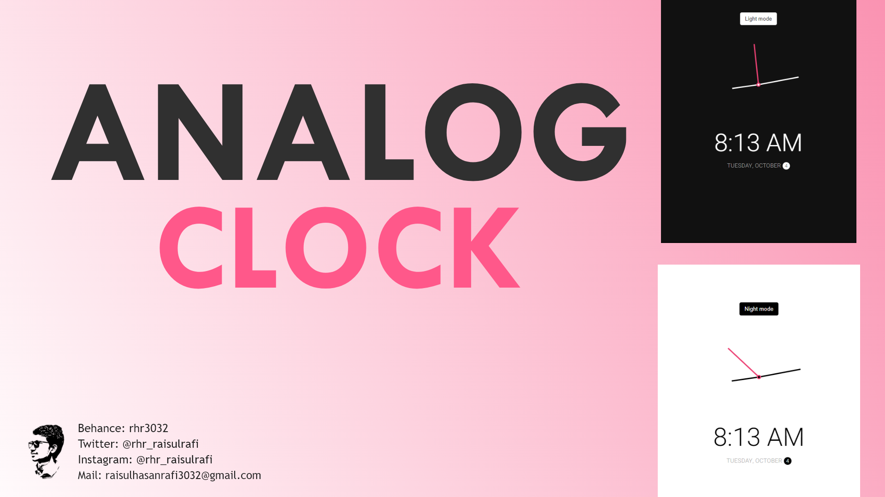

# Analog Clock | NUYsDev 🖥️
## [Preview](https://rhr3032.github.io/Analog_Clock_02/) | [UI Design](#)

### Include this Project ➡️

- Full Responsive byUsing HTML CSS & JavaScript.
- Mobile Friendly Design
- Fresh And Clean Code
- Includes a Night and Light mode.
- Compatible with all mobile devices and with a beautiful and pleasant user interface.

## About Mine
### Hello 👋🏻 I'm Raisul Hasan Rafi, a Full-Stack Web Developer. Also skilled in UI/UX Design. Development is my passion and I love to do it.

## Contact Me
### E-Mail: raisulhasanrafi3032@gmail.com
### | [Instagram](https://instagram.com/rhr_raisulrafi) | [Twitter](https://twitter.com/rhr_raisulrafi) | [LinkedIn](https://linkedin.com/in/rhr3032) | [Facebook](https://facebook.com/rhr.raisulrafi) | [WhatsApp](https://api.whatsapp.com/send?phone=%208801795408194......)
